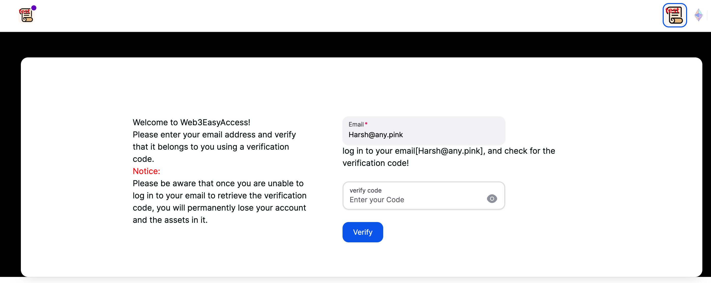
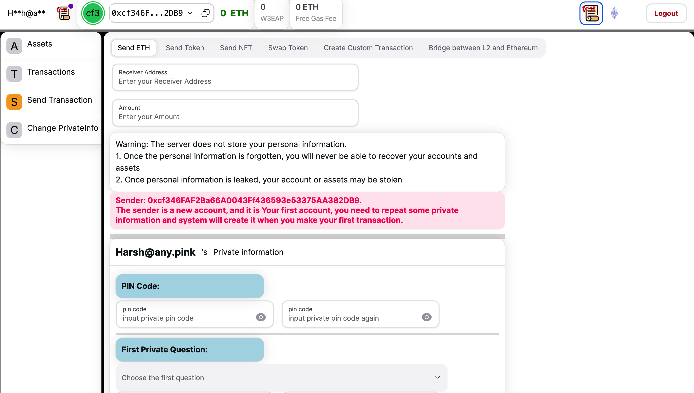

# Easy Access Coin Exchange - Decentralized Cryptocurrency Exchange

Welcome to Easy Access Coin Exchange, a decentralized cryptocurrency exchange platform powered by the Ethereum blockchain and React.JS. Easy Access Coin Exchange enables users to buy, sell, and trade various cryptocurrencies in a secure and transparent manner.

## Introduction

Easy Access Coin Exchange revolutionizes the cryptocurrency trading experience by leveraging blockchain technology. With Easy Access Coin Exchange, you can explore a decentralized ecosystem where trust and transparency are paramount. 

By harnessing the power of smart contracts, Easy Access Coin Exchange ensures that trades are securely executed, and users are protected.

## Live Demo

Test the Application at:
[Demo Link](https://www.web3easyaccess.link/)

## Key Features
- **Decentralized Trading:** Utilize Ethereum's blockchain to decentralize the cryptocurrency trading process, eliminating intermediaries and reducing fees.

- **Multi-Coin Support:** Seamlessly trade a wide range of cryptocurrencies, including popular coins and tokens.

- **Smart Contracts:** Smart contracts automate trade execution, ensuring that trades are securely and transparently executed.

- **Transparency:** Transparent trade records and financial data are stored on the blockchain for public scrutiny.

- **User-Friendly Interface:** An intuitive React.js frontend ensures a smooth and enjoyable user experience.

- **Security:** Advanced security measures, including encryption and secure wallets, protect user funds and data.

## ScreenShot

## Contact

- **Author**: Harsh Agrawal & Venky Kumar

- **`GitHub`**: [harshagrawal2503](https://github.com/harshagrawal2503)
- **`GitHub`**: [BoddepallyVenkatesh06](https://github.com/BoddepallyVenkatesh06)

For any inquiries or support, please get in touch with me through GitHub.