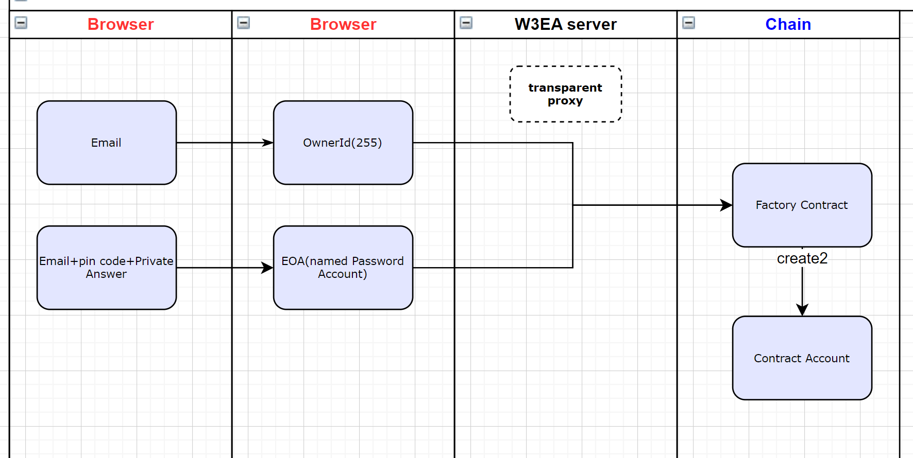
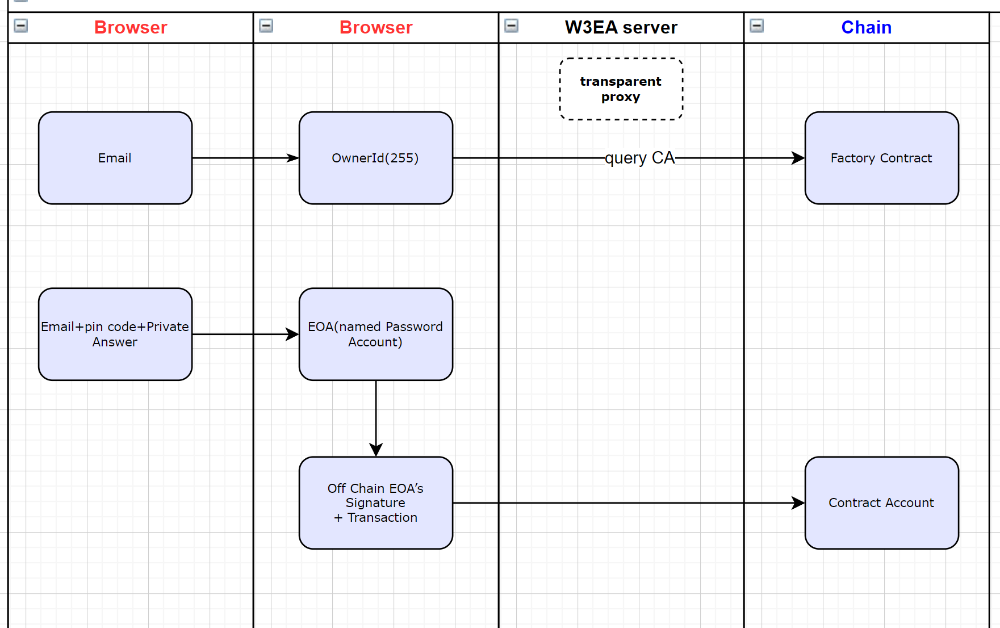

# Web3EasyAccess

Welcome to: [web3easyaccess.link](https://www.web3easyaccess.link/)

## What is Web3EasyAccess

Web3EasyAccess: Provides an easy way to access the web3 world. People can log in to this website just like a regular Web2 website and then manage decentralized assets and explore the decentralized world.\
We utilize EIP712 to implement this system. Through the services provided by this system, users do not need to manage mnemonic phrases or private keys, but instead control their accounts using their own passwords, while still retaining the key features of "decentralization". Additionally, users can modify their existing password information while keeping their account addresses unchanged.

## System implementation principle

### Background knowledge: Understanding EOA and CA

-   An Externally Owned Account (EOA) is a type of account on blockchains like Ethereum. Each EOA is tied to a private key, which is used to initiate all transactions on the blockchain. The initiating EOA also pays the network fee (gas). To use an EOA, individuals need to use a decentralized wallet to manage their mnemonic phrase, from which the private key and EOA are derived.
-   In addition to Externally Owned Accounts, Ethereum has Contract Accounts (CAs). CAs, unlike EOAs, are not controlled by private keys.
-   Unlike externally owned accounts, contract accounts cannot initiate transactions independently. However, they can be coded with smart contracts to perform a wide range of automated functions.
-   Both contract accounts and EOA accounts can manage assets.

### System working principle

#### Create account

On the browser side, the system operates in two phases:

1. A unique ownerId is derived from the user's email, up to a maximum of 255. Each ownerId is associated with a distinct funding account, which is a smart contract.
2. An EOA address, or "password address," is generated based on the user's email and password. This address, which is not disclosed to the user, controls multiple funding accounts associated with the same email.
3. The backend server acts as an intermediary, creating new contract accounts on behalf of users by interacting with a factory contract.

#### Submit a transaction

As shown in the diagram, when a user initiates a transaction, they are required to input their password. The system generates a "password address" on the browser side and creates a one-time electronic signature for this address. Subsequently, our system sends the user's electronic signature to the user's smart contract funding account. Within the smart contract, the user's signature is verified. Only upon successful verification will the subsequent transaction be executed.

The backend application server (W3EA server) functions as a receiver of user requests and utilizes a dedicated EOA to send requests to the blockchain, including account creation and transaction initiation. When creating an account, a request is sent to a "factory contract," which in turn creates a new, independent smart contract account for the user. Throughout this entire process, our backend system never obtains or stores the user's password information.

### A decentralized understanding of password information

1. This system preserves the core attribute of blockchain technology: decentralization. This means that the system does not maintain a centralized database of users' private information. Consequently, if a user forgets their password, they will permanently lose access to their account. However, a future account guardianship feature will allow users to designate trusted individuals, such as friends or family, to regain control of the account.
2. User email addresses cannot be used for password recovery.

### What is the payment method for gas fees

-   The fee for each transaction is calculated automatically by the system and included as a parameter in the user contract. The fee is deducted from the user's account upon transaction execution.
-   If a transaction fails after initiation, it will result in a loss of system assets (while users will not incur any losses).

### Reward design for interactions

-   A transaction within the system will reward users with W3EAP tokens. The reward amount is calculated by multiplying a base value (determined by gas consumption) with a time-dependent multiplier. This multiplier starts at 12 on July 1, 2024, and decreases by approximately 1 each month until it reaches a constant value of 1 after a year.
-   The functions of the token W3EAP have not yet been defined and will be enabled in the future.

## User guide

-   to be supplemented

## Roadmap

web3easyaccess is a project that I am deeply invested in. I will be dedicating all my time and effort to its development and refinement. The platform currently supports transaction query, password reset, ETH transfers, and interactive reward distribution. Our roadmap includes:

-   2024Q3:

1. Enhancing gas fee estimation for layer2 transactions;
2. Implementing ERC20 and ERC721 token transfers;
3. Implementing asset bridging between Scroll and the Ethereum mainnet;
4. Conducting performance benchmarks, optimizations, and hardware upgrades;
5. Refining the interactive reward mechanism;
6. User testing on the Scroll testnet;
7. launch on Scroll mainnet(formal network);
8. Small scale promotion, the target is the number of transaction addresses on the chain is not less than 100.

-   2024Q4:

9. Synchronizing password changes across Scroll and the Ethereum mainnet;
10. Providing customizable transaction parameters;
11. Integrating with the top 3 DEXs on Scroll;
12. further promote, the goal is to have no less than 1000 transaction addresses on the chain..

-   2025Q1:

13. Introducing account guardianship features;
14. Enabling autonomous upgrades for account functions;
15. Adopting USD-based asset pricing;
16. Supporting batch transactions.
17. Connect to at least one other hot dapp
18. Continuous promotion, with the goal of no less than 3000 transaction addresses on the chain.

-   2025Q2:

19. Connect to more DApps
20. Continuous promotion, with the goal of no less than 10000 transaction addresses on the chain.

